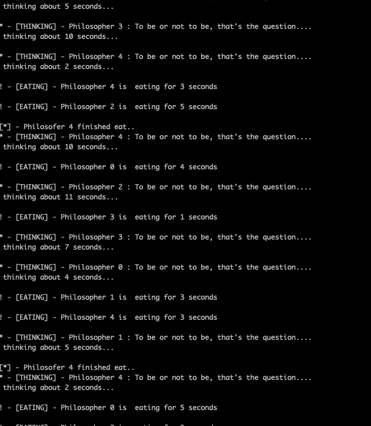

<h1 align="center">The dining philosophers problem</h1>


---

<h2 align="center"> The dining philosopher's problem is a version of the classical synchronization problem, in which five philosophers sit around a circular table and alternate between thinking and eating. A bowl of noodles and five forks for each of the philosophers is placed in the center of the table</h2>

* There are certain conditions a philosopher must follow
    - A philosopher must use both their right and left forks to eat
    - A philosopher can only eat if both of his or her immediate left and right forks are available. If the philosopher's immediate left and right forks are not available, the philosopher places their (either left or right) forks on the table and resumes thinking.


* Problem solved with C++

<h3> Compiling instructions </h3>

<p> Needs GCC </p>

```bash
 gcc src/main.cpp -pthread -o 5philosopher
 ./5philosopher
```

* POC

